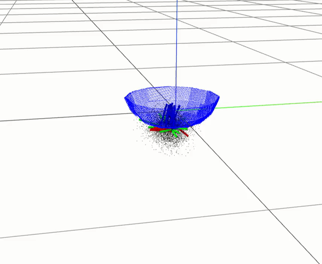

# Relational Neural Descriptor Fields (R-NDF)

PyTorch implementation for training continuous 3D neural fields to represent dense correspondence across objects, and using pairs of these descriptor fields to mimic demonstrations of a relational object rearrangement task on a robotic system.

<p align="center">

</p>

---

This is the reference implementation for our CoRL 2022 paper:

### SE(3)-Equivariant Relational Rearrangement with Neural Descriptor Fields
[**PDF**](https://arxiv.org/abs/2211.09786) | [**Video**](https://youtu.be/1TyHCeUc6C0)

[Anthony Simeonov*](https://anthonysimeonov.github.io/), [Yilun Du*](https://yilundu.github.io/), [Yen-Chen Lin](https://yenchenlin.me/), [Alberto Rodriguez](http://meche.mit.edu/people/faculty/ALBERTOR@MIT.EDU), [Leslie P. Kaelbling](https://people.csail.mit.edu/lpk/), [Tomas L. Perez](https://people.csail.mit.edu/tlp/), [Pulkit Agrawal](http://people.csail.mit.edu/pulkitag/) (*Equal contribution)

---

## Setup
**Clone this repo**
```
git clone https://github.com/anthonysimeonov/relational_ndf.git
cd relational_ndf
```


**Install dependencies** (using a virtual environment is highly recommended):
```
# first, install numpy and cython
pip install numpy cython
# then install requirements and rndf_robot package
pip install -e .
```

**Setup environment variables** (this script must be sourced in each new terminal where code from this repository is run)

```
source rndf_env.sh
```

**Setup meshcat visualizer** (we use [meshcat](https://github.com/rdeits/meshcat-python) for 3D visualization (point clouds, meshes, PyBullet environment) for nearly all the tools in this repo. If one of the scripts here hangs and doesn't do anything, it is probably because the meshcat server isn't running!)

In a background terminal:
```
meshcat-server
```
To view the visualizer, you can connect to the URL that is printed (the default should be `http://127.0.0.1:7000/static/`). Ensure the port for the `zmq_url` that is created matches what's used in each of the scripts (the default is `6000`). 

## Training
**Download all data assets**

Download the "mini" training set, to make sure things are running correctly:
```
./scripts/download_mini_training_data.bash 
```

If you want the full dataset (~250GB for 5 object classes):
```
./scripts/download_training_data.bash 
```
If you want just the mug dataset (~50 GB -- other object class data can be downloaded with the according scripts):
```
./scripts/download_mug_training_data.bash 
```

Also download the ground truth SDF data for all the objects:
```
./scripts/download_obj_sdf_data.bash
```

If you want to recreate your own dataset, see Data Generation section

**Run training**
```
cd src/rndf_robot/training
python train_vnn_sdf_net.py --experiment_name bottle_rndf --is_shapenet --obj_class bottle
```
More information on training [here](doc/training.md)

## Evaluation in simulation

**Download all the object data assets**
```
./scripts/download_obj_mesh_data.bash
```

**Download pretrained weights**
```
./scripts/download_demo_weights.bash
```

**Download demonstrations**
```
./scripts/download_relational_demonstrations.bash
```

**Run evaluation**

If you are running this command on a remote machine, be sure to remove the `--pybullet_viz` flag!

```
cd src/rndf_robot/eval
CUDA_VISIBLE_DEVICES=0 \
    python evaluate_relations_multi_ndf.py --parent_class mug --child_class bowl \
    --exp bowl_on_mug_upright_pose_new \
    --parent_model_path ndf_vnn/rndf_weights/ndf_mug.pth \
    --child_model_path ndf_vnn/rndf_weights/ndf_bowl.pth \
    --is_parent_shapenet_obj --is_child_shapenet_obj \
    --rel_demo_exp release_demos/bowl_on_mug_relation \
    --pybullet_server \
    --opt_iterations 650 \
    --parent_load_pose_type random_upright --child_load_pose_type random_upright \
    --pybullet_viz
```

For debugging, it can be useful to watch the query point optimization in meshcat. To turn this on, add the `--opt_visualize` flag, and you should see something like the below (slightly sped up) GIF in the visualizer:

<p align="center">

</p>

More information on experimental evaluation can be found [here](./doc/eval.md). 

## Data Generation
**Download all the object .obj assets and ground truth SDF samples**
```
./scripts/download_obj_data.bash
```

**Run data generation**

ShapeNet objects
```
cd src/rndf_robot/data_gen
python shapenet_pcd_gen.py \
    --total_samples 100 \
    --object_class mug \
    --save_dir test_mug \
    --rand_scale \
    --num_workers 2
```

Non-shapenet objects (i.e., that are manually synthesized, such as our synthetic racks or containers)

```
# racks:
cd src/rndf_robot/data_gen
python syn_obj_pcd_gen.py \
    --object_class syn_rack_easy \
    --save_dir test_syn_rack \
    --total_samples 100 \
    --obj_file_dir syn_racks_easy_obj_unnormalized \
    --config syn_rack_easy_data_gen.yaml \
    --rand_scale \
    --num_workers 2

# containers:
cd src/rndf_robot/data_gen
python syn_obj_pcd_gen.py \
    --object_class syn_container \
    --save_dir test_syn_container \
    --total_samples 100 \
    --obj_file_dir box_containers_unnormalized \
    --config container_data_gen.yaml \
    --rand_scale \
    --num_workers 2

```

**Generate your own ground truth signed-distance values**

ShapeNet objects
```
python prepare_sdf_from_obj.py \
    --dataset_name test_mug_sdf \
    --models_directory mug_centered_obj_normalized \
    --is_shapenet

```

Non-shapenet objects
```
python prepare_sdf_from_obj.py \
    --dataset_name test_syn_rack_sdf \
    --models_directory syn_racks_easy_obj_unnormalized 
```

**Generate your own synthetic container/rack .obj files**

(and, optionally, ground truth occupancy)
```
# racks:
cd src/rndf_robot/data_gen/model_gen
python generate_syn_racks.py \
    --obj_name test_syn_rack \
    --mesh_save_dir test_syn_racks \
    --occ_save_dir test_syn_racks_occ  # include --save_occ to also save normalized files and occupancy

# containers:
cd src/rndf_robot/data_gen/model_gen
python generate_syn_containers.py \
    --obj_name test_syn_container \
    --mesh_save_dir test_syn_container \
    --occ_save_dir test_syn_container_occ 
```

More information on dataset generation can be found [here](./doc/dataset.md). 

## Collect new demonstrations with teleoperated robot in PyBullet
Make sure you have downloaded all the object data assets (see Data Generation section)

**Run teleoperation pipeline**
```
cd src/rndf_robot/demonstrations
python relational_demos.py --exp test_bottle_in_container --parent_class syn_container --child_class bottle --is_child_shapenet_obj
```
More information on collecting rearrangement demonstrations can be found [here](./doc/demonstrations.md). 

## Additional repository notes

**Demonstration query point alignment**

One critical step in allowing the rearrangement task to succeed with R-NDF is to use the NDF models to align the demonstrations relative to each other before extracting an average target descriptor for test-time object part localization. The `create_target_descriptors` in the file [`eval/relation_tools/multi_ndf.py`](../src/rndf_robot/eval/relations_baseline/multi_ndf_intersection.py) performs this alignment, and by default it is called at the beginning of the [simulation evaluation script](../src/rndf_robot/eval/evaluate_relations_sim.py). The alignment operates by obtaining a 3D keypoint in the vicinity of the parts of the two objects that physically interact to satisfy the relation (e.g., near the mug's handle and racks' peg for _mug on rack_, near the bottom of the bowl and the top of the mug for _bowl on mug_, and near the bottom of the bottle and the bottom surface of the container for _bottle in container_). While these keypoints can be specified fully by hand, we found it useful to initialize the position with some heuristics, such as an approximate centroid of the region where the bounding box of the two objects intersect, or at some fixed offset from a known semantically meaningful position on one of the object (such as a few cm below the bottom of the bottle). We provide an interface to view this estimated keypoint position and then further refine it as desired. 

**PyBullet visualization through meshcat**

We built off of the [PyBullet recorder tool](https://github.com/huy-ha/pybullet-blender-recorder/blob/master/pyBulletSimRecorder.py) found in [Huy Ha's amazing PyBullet-to-Blender repo](https://github.com/huy-ha/pybullet-blender-recorder) to use meshcat as a visualizer for a PyBullet running headless on a remote machine. Our version of this "PyBullet recorder" can be found in [`utils/pb2mc/pybullet_meshcat.py`](../src/rndf_robot/utils/pb2mc/pybullet_meshcat.py). It operates by registering object geometries that are loaded into the PyBullet scene and then continually updating their world frame pose in a background thread. The functionality can admittedly be a little buggy and the implementation can _certainly_ be improved. Erwin Coumans has done something similar in the past in his [tiny differentiable simulator repo](https://github.com/erwincoumans/tiny-differentiable-simulator#meshcat-visualization), probably in a way that functions a lot more robustly than ours. We are open to pull requests for helping improve the functionality of this tool to make it easier to visualize a PyBullet environment remotely in a web browser! Examples of the visualizer reflecting the PyBullet scene for our _bowl on mug_ evaluation and providing _mug on rack_ demonstrations with the panda are below.

<p align="center">


</p>


## TODO
- Add EBM code
- Add real robot pipeline

# Citing
If you find our paper or this code useful in your work, please cite our paper:
```
@inproceedings{simeonov2022relational,
  title={SE(3)-Equivariant Relational Rearrangement with Neural Descriptor Fields},
  author={Simeonov, Anthony and Du, Yilun and Yen-Chen, Lin and and Rodriguez, Alberto and and Kaelbling, Leslie P. and Perez, Tomas L. and Agrawal, Pulkit},
  booktitle={Conference on Robot Learning (CoRL)},
  year={2022},
  organization={PMLR}
}
```

# Acknowledgements
Parts of this code were built upon the implementations found in the [occupancy networks repo](https://github.com/autonomousvision/occupancy_networks), [convolutional occupancy networks repo](https://github.com/autonomousvision/convolutional_occupancy_networks), [vector neurons repo](https://github.com/FlyingGiraffe/vnn), [shapegan repo](https://github.com/marian42/shapegan), and the [original NDF repo](https://github.com/anthonysimeonov/ndf_robot). 
